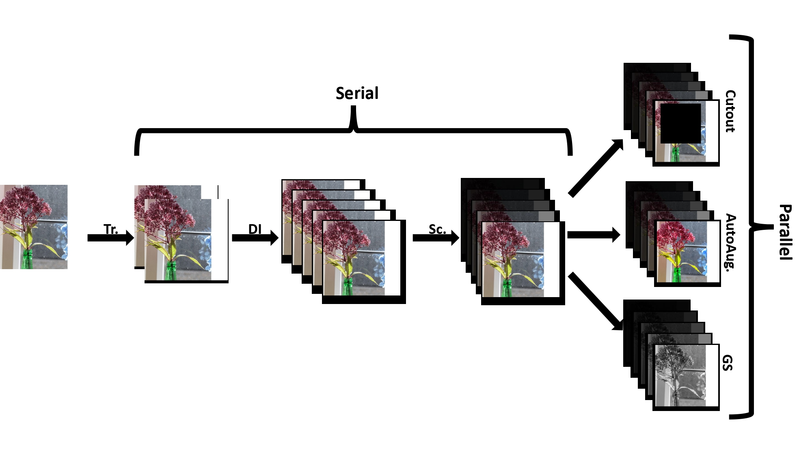

# The Ultimate Combo: Boosting Adversarial Example Transferability by Composing Data Augmentations

This repo was put together to help reproduce the results of our AISec'24 paper (https://arxiv.org/abs/2312.11309). We use parallel composition method to integrate as many augmentation methods as possible to improve the transferability of adversarial examples. We also propose a new method called Ultimate Combo, which can be used to combine different augmentation methods to boost adversarial example transferability.


## Dependencies

Run the following command to install dependencies:

```bash
pip install -r requirements.txt
```

## Models and data

Pre-trained model weights ([link](https://github.com/ylhz/tf_to_pytorch_model)) and data ([link](https://github.com/ylhz/tf_to_pytorch_model/tree/main/dataset)) should be downloaded and placed under the directories **torch_nets_weight/** and **dataset/**, respectively.  


## Running code

1. Run the following to test the *GS-DST-MI-FGSM* attack:
```bash
python attack.py --method GS-DST --batch_size 2
```
2. Run the following to test the $UltimateCombo_{base}$ attack:

```bash
python attack.py --method ultimate_combo --batch_size 2
```

3. Run the following to test the *DST-MI-FGSM* attack：

```bash
python attack.py --method SI_DI_TI_MIFGSM --batch_size 2
```

4. Run the following to test the *Admix-DT-MI-FGSM* attack：

```bash
python attack.py --method admix_DI_TI_FGSM --batch_size 2
```

5. To run the search experiments of all compositions with Admix:

```bash
python attack.py --method grid_search{ordernumber} --batch_size 2
```
Where `orderednumber` is the decimal representation of a 6-bit string, where 0 indicates excluding an augmentation method, and 1 indicates including it, for the following augmentation methods: greyscale, cutout, neural transfer, sharpening, autoaugment, and DTS (in this specific order). For example, when ordernumber is 55, which can be converted to 110111, meaning we include greyscale, cutout, sharpening,autoaugment, DTS into combo (neural transfer is excluded).

6.	To run the    $UltimateCombo_{gen}$:

```bash
bash run.sh
```
All these commands can be used to generate table 2.

7. To calculate the cosine similarity between surrogate and target in terms of adversarial examples, use option --cosine, these commands can be used to generate Figure 1.


8. To run ensemble attack, please use the following command:

```bash
python ensemble_attack.py --method {method_name} --batch_size 2
```
where {method_name} is the name of the attack method, e.g., ens_SDTMIFGSM, ens_greyschale_FGSM, ens_VMI_DI_TI_SI_FGSM,ens_UC_base,ens_UC_gen.

Command 8 is used to generated table 3.

9. To perform these attacks on cifar-10,   use option --dataset=cifar-10, this command is  used to generate Table 5.
10. To  perform individual augmentations composed with DST (figures in table 1), please siwtch --method to 'CS-DST' , 'CJ-DST' and 'fPCA-DST', "RE-DST", "CutMix-DST", "CutOut-DST","NeuTrans-DST", "Sharp-DST", " AutoAugment-DST" accordingly.
11. use 'max_epsilon' to perform attack under other constraints (e.g., 8/255 or 32/255),  which is used to generate Table 8.
12. To assess attack success rate against defense model, we take code from [Bit-Red](https://github.com/mzweilin/EvadeML-Zoo), [NRP](https://github.com/Muzammal-Naseer/NRP), [RS](https://github.com/locuslab/smoothing) and [ARS](https://github.com/Hadisalman/smoothing-adversarial). To test it, we generate adversarial examples and save it firstly, then feed it into these defense models.


## Acknowledgements
We use the code from the following repositories:
https://github.com/ylhz/tf_to_pytorch_model

## Citing this work
If you find this work is interesting , please consider citing:

    @article{yun2023ultimate,
    title={The Ultimate Combo: Boosting Adversarial Example Transferability by Composing Data Augmentations},
    author={Yun, Zebin and Weingarten, Achi-Or and Ronen, Eyal and Sharif, Mahmood},
    journal={AISec'24},
    year={2024}
    }
